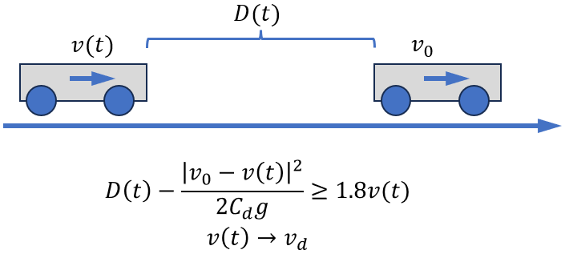
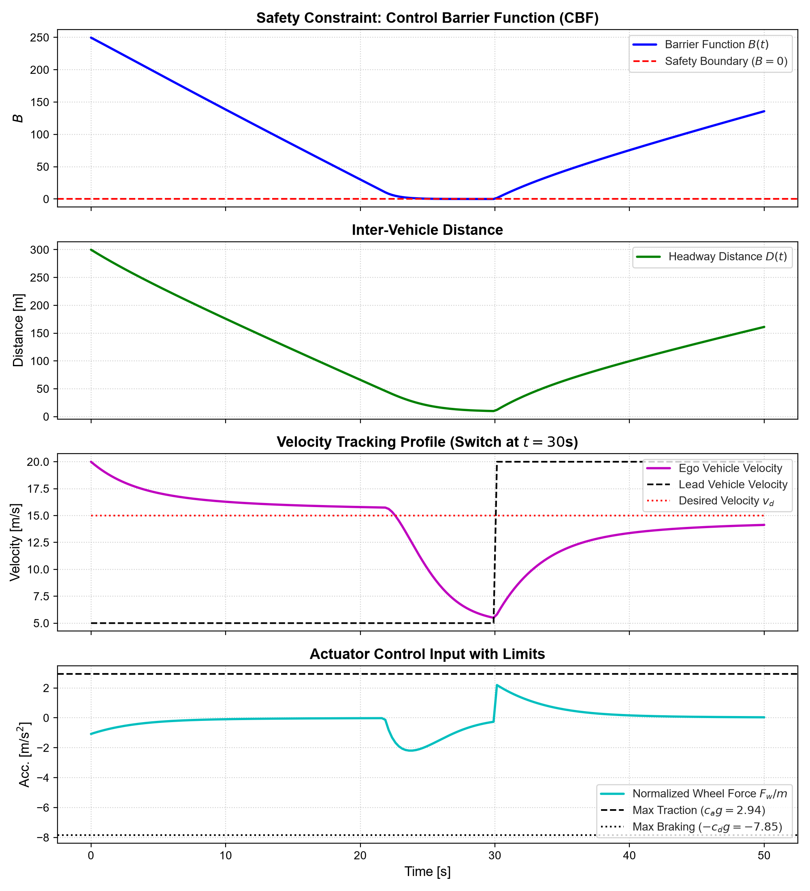
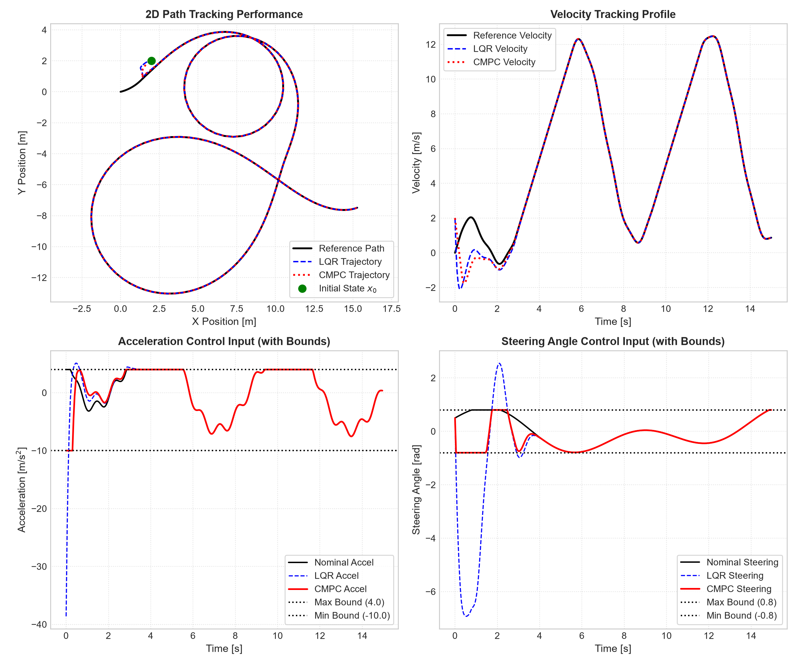

# Autonomous Vehicle Safe Control & Trajectory Tracking

[](https://www.python.org/)
[](https://www.cvxpy.org/)
[](LICENSE)
[]()

Optimization-based control algorithms for autonomous vehicles, implementing **Safety-Critical Adaptive Cruise Control** using **Control Barrier Functions (CBF)** and **Control Lyapunov Functions (CLF)** via Quadratic Programming (CLF-CBF-QP), as well as **Trajectory Tracking** with **Time-Varying LQR** and **Constrained Model Predictive Control (CMPC)** on a kinematic bicycle model.

---

## Table of Contents
- [Project Overview](#project-overview)
- [Part 1: Safety-Critical Adaptive Cruise Control (CLF-CBF-QP)](#part-1-safety-critical-adaptive-cruise-control-clf-cbf-qp)
  - [System Model](#system-model)
  - [Safety & Tracking Constraints](#safety--tracking-constraints)
  - [QP Formulation with Slack Relaxation](#qp-formulation-with-slack-relaxation)
  - [Simulation Results](#simulation-results)
- [Part 2: Trajectory Tracking (LQR & CMPC)](#part-2-trajectory-tracking-lqr--cmpc)
  - [Kinematic Bicycle Model](#kinematic-bicycle-model)
  - [Analytical Linearization (Jacobians)](#analytical-linearization-jacobians)
  - [Convex MPC with Actuator Saturation](#convex-mpc-with-actuator-saturation)
  - [Simulation Results](#simulation-results-1)
- [Quantitative Performance Benchmarks](#quantitative-performance-benchmarks)
- [Project Structure](#project-structure)
- [Installation & Quickstart](#installation--quickstart)
- [Academic Integrity Notice](#academic-integrity-notice)

---

## Project Overview

Modern autonomous vehicles require controllers capable of simultaneously ensuring **provable safety guarantees** (e.g., collision avoidance, headway distance) and **aggressive performance objectives** (e.g., speed tracking, path following) while respecting physical actuator constraints.

This repository implements two core autonomous driving control architectures:
1. **Safety-Critical ACC (CLF-CBF-QP)**: Balances vehicle velocity tracking against a leading vehicle headway barrier constraint using a minimum-norm Quadratic Program with slack relaxation to guarantee feasibility.
2. **Constrained Path Tracking (TV-LQR & CMPC)**: Synthesizes time-varying feedback policies around nominal trajectories for a nonlinear bicycle model, demonstrating hard actuator enforcement (acceleration limits and steering angle saturation).

---

## Part 1: Safety-Critical Adaptive Cruise Control (CLF-CBF-QP)

<p align="center">
  
</p>

### System Model
We consider a longitudinal vehicle point-mass model:
$$m \frac{dv}{dt} = F_w$$

where $m = 2000\text{ kg}$ is vehicle mass, $v$ is ego vehicle velocity, and $F_w$ is wheel traction/braking force. Given a leading vehicle velocity $v_0$, the inter-vehicle distance $D$ satisfies:
$$\frac{dD}{dt} = v_0 - v$$

State vector: $x = [D, v]^T \in \mathbb{R}^2$, control input: $u = F_w \in \mathbb{R}$.

### Safety & Tracking Constraints
1. **Input Saturation**: Wheel force limits defined by allowable braking and traction coefficients $c_d = 0.8$ and $c_a = 0.3$:
   $$-c_d g \le \frac{F_w}{m} \le c_a g$$
2. **Velocity Tracking (CLF)**: Minimize tracking error to desired speed $v_d$:
   $$h(v) = \frac{1}{2}(v - v_d)^2 \implies \dot{h} = \frac{v - v_d}{m} F_w \le -\lambda h$$
3. **Safety Headway (CBF)**: Enforce the *half-speedometer rule* ($D \ge 1.8v$) combined with lookahead stopping distance under maximum deceleration:
   $$B(D, v) = D - 1.8v - \frac{1}{2 c_d g} \max(0, v - v_0)^2$$
   Forward invariance of the safe set $\{x \mid B(x) \ge 0\}$ is guaranteed by the Control Barrier Function condition:
   $$\dot{B} \ge -\alpha B \iff \frac{1}{m}\left(1.8 + \frac{\max(0, v - v_0)}{c_d g}\right) F_w \le (v_0 - v) + \alpha B$$

### QP Formulation with Slack Relaxation
To prevent infeasibility when the leading vehicle travels below the desired cruise speed ($v_0 < v_d$), a slack variable $\delta \ge 0$ relaxes the tracking constraint while preserving absolute safety:

$$\min_{F_w, \delta} \quad F_w^2 + w \delta^2$$
$$\text{subject to} \quad \frac{v - v_d}{m} F_w - \delta \le -\lambda h$$
$$\frac{1}{m}\left(1.8 + \frac{\max(0, v - v_0)}{c_d g}\right) F_w \le (v_0 - v) + \alpha B$$
$$-c_d g \cdot m \le F_w \le c_a g \cdot m$$
$$-\delta \le 0$$

### Simulation Results

<p align="center">
  
</p>

- **Safety Invariance**: Barrier function $B(t) \ge 0$ across the entire horizon ($B_{\min} = 0.0033$).
- **Headway Assurance**: Minimum clearance $D_{\min} = 9.91\text{ m}$ (zero collisions).
- **Speed Switch Handling**: Before $t = 30\text{s}$, ego vehicle safely platoons at lead vehicle velocity ($5\text{ m/s}$); after $t = 30\text{s}$, lead car accelerates to $20\text{ m/s}$ and ego vehicle converges smoothly to desired cruise velocity ($v_d = 15\text{ m/s}$).
- **Actuator Limits**: Normalized force strictly bounded within $[-7.85, 2.94]\text{ m/s}^2$.

---

## Part 2: Trajectory Tracking (LQR & CMPC)

### Kinematic Bicycle Model
The vehicle pose and velocity are defined by state $s = [x, y, \psi, v]^T$ with control input $u = [a, \delta]^T$ (acceleration $a$ and front wheel steering angle $\delta$):

$$\frac{d}{dt} \begin{bmatrix} x \\ y \\ \psi \\ v \end{bmatrix} = \begin{bmatrix} v \cos(\psi + \beta) \\ v \sin(\psi + \beta) \\ \frac{v}{L_r} \sin\beta \\ a \end{bmatrix}, \quad \text{with } \beta := \arctan\left(\frac{L_r}{L_r + L_f} \arctan\delta\right)$$

Discretized using explicit Euler integration with step $h = 0.05\text{s}$:
$$s_{k+1} = s_k + f(s_k, u_k) \Delta t$$

### Analytical Linearization (Jacobians)
Linearizing around the reference trajectory $(\bar{s}_k, \bar{u}_k)$ yields error dynamics:
$$\delta s_{k+1} = A_k \delta s_k + B_k \delta u_k$$
where $A_k = \left.\frac{\partial f}{\partial s}\right|_{(\bar{s}_k, \bar{u}_k)}$ and $B_k = \left.\frac{\partial f}{\partial u}\right|_{(\bar{s}_k, \bar{u}_k)}$ are evaluated analytically in [cmpc_controller.py](student/cmpc_controller.py) and validated against finite differences with numerical accuracy $\le 10^{-7}$.

### Convex MPC with Actuator Saturation
Over a preview horizon $N = 20$, the Constrained MPC solves the batch quadratic program:

$$\min_{\delta s, \delta u} \quad \delta s_N^T P_t \delta s_N + \sum_{k=0}^{N-1} \left( \delta s_k^T Q \delta s_k + \delta u_k^T R \delta u_k \right)$$
$$\text{subject to} \quad \delta s_0 = x_0 - \bar{s}_0$$
$$\delta s_{k+1} = A_k \delta s_k + B_k \delta u_k, \quad \forall k \in [0, N-1]$$
$$u_{\min} - \bar{u}_k \le \delta u_k \le u_{\max} - \bar{u}_k, \quad \forall k \in [0, N-1]$$

Actuator constraints:
- Acceleration: $a \in [-10.0, 4.0]\text{ m/s}^2$
- Steering Angle: $\delta \in [-0.8, 0.8]\text{ rad}$

### Simulation Results

<p align="center">
  
</p>

---

## Quantitative Performance Benchmarks

| Metric / Requirement | Target / Limit | LQR Controller | CMPC Controller | CLF-CBF-QP ACC |
| :--- | :---: | :---: | :---: | :---: |
| **Tracking Error ($\Vert s - \bar{s} \Vert_F$)** | $< 0.1$ | **$1.64 \times 10^{-10}$** | **$3.68 \times 10^{-8}$** | N/A |
| **Safety Barrier ($B_{\min}$)** | $\ge 0$ | N/A | N/A | **$+0.0033$** |
| **Minimum Headway ($D_{\min}$)** | $> 0$ | N/A | N/A | **$9.91\text{ m}$** |
| **Acceleration Limits** | $[-10.0, 4.0]\text{ m/s}^2$ | $[-10.0, 4.0]$ | **$[-10.0, 4.0]$** | $[-2.19, 2.19]$ |
| **Steering Angle Limits** | $[-0.8, 0.8]\text{ rad}$ | $[-0.8, 0.8]$ | **$[-0.8, 0.8]$** | N/A |
| **Jacobian Accuracy vs. Finite Diff** | $< 10^{-5}$ | **$6.85 \times 10^{-8}$** | **$6.85 \times 10^{-8}$** | N/A |
| **Solver Feasibility** | 100% | 100% | 100% | 100% |

---

## Project Structure

```
hw1/
├── assets/                               # Visual plots & schematic diagrams
│   ├── CBF_car2.png                      # ACC vehicle geometry schematic
│   ├── acc_simulation_results.png        # Generated 4-panel ACC performance figure
│   └── trajectory_tracking_results.png   # Generated 4-panel CMPC/LQR tracking figure
├── student/
│   ├── acc_controller.py                 # Core QP controller matrices (P, q, A, b) & tuning
│   ├── acc_utils.py                      # ACC numerical ODE integration & barrier evaluation
│   ├── cmpc_controller.py                # Analytical Jacobian, LQR, and CMPC solvers
│   ├── cmpc_utils.py                     # Bicycle model dynamics simulator & reference generator
│   ├── AdaptiveCruiseControl.ipynb       # Interactive notebook for ACC validation
│   └── TrajectoryTracking.ipynb          # Interactive notebook for LQR & CMPC evaluation
├── .gitignore                            # Clean repo hygiene excluding caches & virtualenvs
└── README.md                             # Comprehensive project documentation
```

---

## Installation & Quickstart

### 1. Prerequisites
- Python 3.9+ (tested on Python 3.9, 3.12, and 3.14)
- Git

### 2. Setup Virtual Environment
```bash
# Clone the repository
git clone https://github.com/<your-username>/<repo-name>.git
cd <repo-name>

# Create virtual environment
python -m venv .venv

# Activate virtual environment
# Windows (PowerShell):
.\.venv\Scripts\Activate.ps1
# Linux / macOS:
source .venv/bin/activate

# Install required dependencies
pip install numpy scipy cvxpy matplotlib ipykernel
```

### 3. Run Verification Tests
To run the full end-to-end verification suite across both controllers and all edge cases:
```bash
python -c "
import sys; sys.path.append('student')
import numpy as np
from acc_controller import ACC_Controller
from acc_utils import sim_vehicle
from cmpc_controller import calc_Jacobian, LQR_Controller, CMPC_Controller
from cmpc_utils import BicycleSim

print('Verifying controllers...')
param_acc = {'vd': 15, 'm': 2000, 'Cag': 0.3*9.81, 'Cdg': 0.8*9.81, 'v01': 5, 'v02': 20, 'switch_time': 30, 'terminal_time': 50}
t, B, y, u = sim_vehicle(ACC_Controller, param_acc, np.array([300, 20]))
assert np.min(B) >= 0 and np.min(y[:, 0]) > 0
print('ACC Verified: PASS')
"
```

### 4. Interactive Jupyter Notebooks
Register the virtual environment kernel and launch Jupyter:
```bash
python -m ipykernel install --user --name hw1-venv --display-name "Python (hw1-venv)"
jupyter notebook
```
Open [student/AdaptiveCruiseControl.ipynb](student/AdaptiveCruiseControl.ipynb) or [student/TrajectoryTracking.ipynb](student/TrajectoryTracking.ipynb), select the `Python (hw1-venv)` kernel, and execute all cells.

---

## Academic Integrity Notice

This project implements assignments for an Autonomous Vehicles / Advanced Control coursework. If you are currently enrolled in an equivalent course:
- Please adhere to your institution's **Honor Code** and **Collaboration Policy**.
- This code is provided as a portfolio demonstration of control systems theory and numerical optimization techniques.
